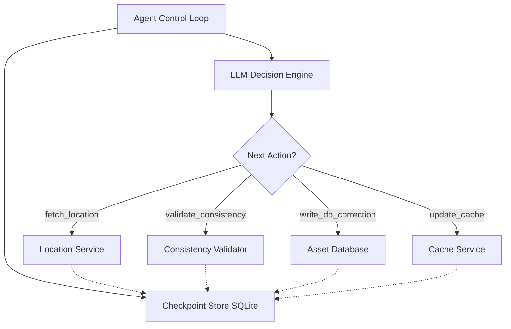

# Resilient Asset Agent

A fault-tolerant AI agent that synchronizes asset state across distributed services with intelligent failure recovery.

## Overview

This project implements a **LLM-driven workflow orchestrator** that:
- Executes multi-step asset synchronization workflows
- Detects and recovers from partial failures without re-doing completed work
- Maintains persistent checkpoint state for crash recovery
- Uses local LLM (Qwen 35B) for dynamic decision-making

## Architecture



## Components

### `stubs/services.py` - Mock Distributed Services
- **LocationService**: Returns asset coordinates (supports stale data injection)
- **AssetDatabase**: Handles persistent writes (supports partial write simulation)
- **CacheService**: Fast cache layer (most failure-prone - can timeout independently)

### `agent/checkpointer.py` - State Persistence
- SQLite-based checkpoint store
- Idempotency guarantees (never re-executes completed steps)
- Full execution trace for audit/debugging

### `agent/tools.py` - Idempotent Tool Wrappers
- Each tool checks checkpoint before execution
- Returns cached results if step already completed
- Logs failures with error details

### `agent/runner.py` - Agent Control Loop
- LLM-driven dynamic workflow (not fixed sequence)
- Evaluates current state to decide next action
- Handles max iterations and recovery logic

## Quickstart

### Prerequisites
- Python 3.10+
- Local LLM server running on `localhost:8000` (e.g., `llama-server.exe`, LM Studio, vLLM)

### Installation

```bash
# Create virtual environment
python -m venv venv
.\venv\Scripts\activate  # Windows
source venv/bin/activate  # macOS/Linux

# Install dependencies
pip install -r requirements.txt
```

### Running the Agent

**Normal execution (no failures):**
```bash
python main.py --run-id test-001
```

**Simulate cache timeout after DB write:**
```bash
python main.py --run-id demo-failure --fail-at cache_update
```

**Simulate stale location data:**
```bash
python main.py --run-id demo-stale --inject-stale
```

**Combine failure injections:**
```bash
python main.py --run-id complex-scenario --fail-at cache_update --partial-write
```

## Failure Recovery Demo

### Scenario: Cache Timeout After DB Write

1. **First Run**: Agent executes fetch → validate → write_db (success) → update_cache (FAILS with timeout)
2. **Second Run**: Agent reads checkpoint, sees DB write completed, skips it, retries only the failed cache step

This demonstrates the core assessment requirement: **intelligent recovery without duplicating work**.

## What I Would Do With More Time

1. **Distributed Locking**: Implement mutex/lock mechanisms to prevent race conditions in multi-agent scenarios
2. **Saga Pattern**: Add compensation actions (rollback steps) for true saga orchestration
3. **Vector State Logging**: Use embeddings for semantic search of execution history
4. **Retry with Backoff**: Implement exponential backoff for transient failures
5. **Health Check Dashboard**: Real-time monitoring of service health and agent status
6. **Configuration Profiles**: YAML-based failure scenarios for reproducible testing

## Project Structure

```
resilient-asset-agent/
├── stubs/
│   ├── __init__.py
│   └── services.py        # Mock Location, DB & Cache APIs + failure knobs
├── agent/
│   ├── __init__.py
│   ├── checkpointer.py    # SQLite / JSON state persistence
│   ├── tools.py           # Idempotent tool wrappers around stubs
│   └── runner.py          # Ollama LLM prompt loop & dynamic decision maker
├── .gitignore
├── requirements.txt
├── main.py                # Main CLI runner (with failure injection flags)
└── README.md              # This file
```

## License

MIT
