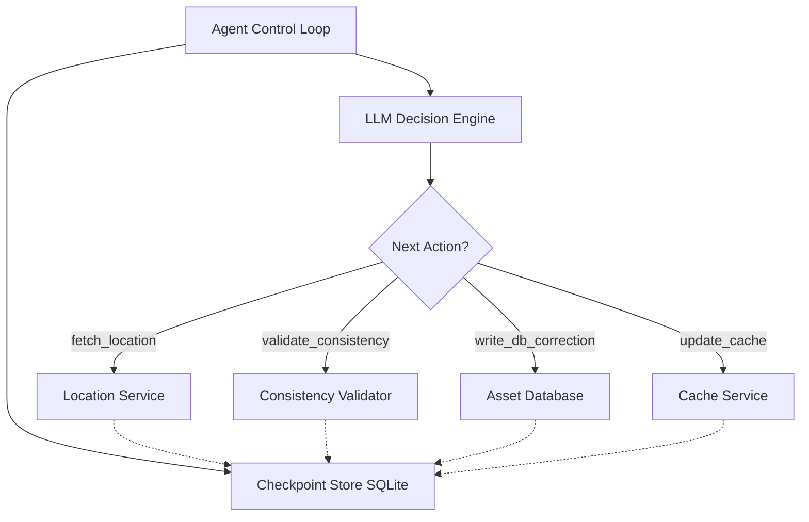

# Resilient Asset Agent

[](https://github.com/saM-Tel/resilient-asset-agent/actions)
[](https://www.python.org/downloads/)
[](https://opensource.org/licenses/MIT)

A fault-tolerant AI agent that synchronizes asset state across distributed services with intelligent failure recovery.

## Overview

This project implements a **LLM-driven workflow orchestrator** that:
- Executes multi-step asset synchronization workflows
- Detects and recovers from partial failures without re-doing completed work
- Maintains persistent checkpoint state for crash recovery
- Uses local LLM (Qwen 3.6 - 35-3ab thinking off) for dynamic decision-making

## Architecture



## Components

### `stubs/services.py` - Mock Distributed Services
- **LocationService**: Returns asset coordinates (supports stale data injection)
- **AssetDatabase**: Handles persistent writes (supports partial write simulation)
- **CacheService**: Fast cache layer (most failure-prone - can timeout independently)

### `agent/checkpointer.py` - State Persistence
- SQLite-based checkpoint store (WAL mode + busy timeout for concurrent reads/writes)
- Idempotency guarantees (never re-executes completed steps)
- Sub-task tracking with `SUCCESS` / `FAILED` / `UNKNOWN` status
- Append-only event log (audit trail / mission log)
- Full execution trace for audit/debugging
- Resilient JSON serialization (`default=str`) for non-primitive payloads
- **Run statuses**: `IN_PROGRESS`, `COMPLETED`, `HALTED`, `FAILED` — `HALTED` distinguishes intentional pauses (service down) from successful completion or unrecoverable errors

### `agent/tools.py` - Idempotent Tool Wrappers
- Each tool checks checkpoint before execution
- Returns cached results if step already completed
- Generates idempotency keys for every mutation
- Tracks sub-task status and emits audit-trail events
- Distinguishes `UNKNOWN` (timeout) from `FAILED` (hard error)
- **Active Read Verification Probes** (Refinement 2): On PARTIAL_FAILURE recovery, calls `verify_db_transaction()` to confirm the write actually committed before skipping — distinguishes UNKNOWN (write may have succeeded) from FAILED (definitely did not happen)

### `agent/runner.py` - Agent Control Loop
- LLM-driven dynamic workflow (not fixed sequence)
- Evaluates current state to decide next action
- Handles max iterations and recovery logic
- Guards `DONE` action against bypassing pending health checks
- Robust LLM response parsing (markdown code blocks, empty responses, fallbacks)

## How to Run It

### Prerequisites
- Python 3.10+
- Local LLM server running on `localhost:8000` (e.g., `llama-server.exe`, LM Studio, vLLM) with model **Qwen 3.6 35B-A3B**

> ⚠️ **Important: Non-Thinking Model Required**
> 
> This agent does **not work reliably with models that use extended thinking/reasoning**. Thinking-mode models often return empty responses or excessively long reasoning traces, causing parse failures and hangs. You must start the LLM server with `--reasoning off` (or equivalent) to disable thinking mode.
> 
> A Windows batch file is provided for launching llama-server with optimized settings:

```batch title="start-llm.bat"
@echo off
title qwen3.6_35B_A3B_MTP_PORT_8000
echo Starting Qwen 3.6 35B-A3B MoE with optimized settings for agent task (Non-Thinking Mode)...

"E:\AI_Workspace\Models\llama\llama-server.exe" ^
  -m E:\AI_Workspace\Models\Qwen3.6-35B-A3B-UD-Q5_K_S.gguf ^
  -fit off ^
  -np 1 ^
  -ngl 99 ^
  -ts 0.50,0.50 ^
  -fa on ^
  -c 200000 ^
  --cache-type-k q8_0 ^
  --cache-type-v q8_0 ^
  --jinja ^
  --reasoning off ^
  --reasoning-budget 0 ^
  --temp 0.1 ^
  --top-k 40 ^
  --min-p 0.05 ^
  --top-p 0.95 ^
  --presence-penalty 0.1 ^
  --repeat-penalty 1.1 ^
  --host 0.0.0.0 ^
  --port 8000 ^
  --spec-type draft-mtp ^
  --spec-draft-n-max 2 ^
  --spec-draft-ngl 99 ^
  --load-mode none
pause
```

**Key settings for agent compatibility:**
| Flag | Purpose |
|---|---|
| `--reasoning off` | Disables thinking mode — **required** |
| `--temp 0.1` | Low temperature for consistent JSON output |
| `--jinja` | Enables Jinja2 templating (better prompt handling) |
| `--cache-type-k/q8_0` | High-precision KV cache for accuracy |
| `-c 200000` | Large context window for full execution traces |

### Installation

```bash
# Create virtual environment
python -m venv venv
.\venv\Scripts\activate  # Windows
source venv/bin/activate  # macOS/Linux

# Install dependencies
pip install -r requirements.txt
```

### Running the Agent

**Normal execution (no failures):**
```bash
python main.py --run-id video-demo
```

**Simulate cache timeout (demonstrates intelligent failure recovery):**
```bash
python main.py --run-id video-demo --fail-at cache_update
```

**Combine multiple failure injections:**
```bash
python main.py --run-id complex-scenario --fail-at cache_update --partial-write
```

**All supported scenario switches:**
- `--fail-at cache_update|location_service|location_unavailable|cache_unavailable|llm_connection`
- `--inject-stale`
- `--partial-write`

**Simulate an LLM connection drop / server outage:**
```bash
python main.py --run-id llm-test --clear --fail-at llm_connection
```
The agent fails at iteration 1 with `Status: FAILED` and an `LLM_SERVER_UNREACHABLE` audit event (subtask `reasoning_engine`). Re-running without the flag resumes from the checkpoint and completes normally — no steps were executed, so nothing is duplicated.

### Scenario Matrix (Validated)

The agent supports 24 initial-run combinations:
- `fail_at`: `none`, `cache_update`, `location_service`, `location_unavailable`, `cache_unavailable`, `llm_connection`
- `inject_stale`: `0|1`
- `partial_write`: `0|1`

Validated outcomes (initial run with `--clear`):

| fail_at | inject_stale | partial_write | Expected Initial Status | Observed |
|---|---:|---:|---|---|
| none | 0 | 0 | COMPLETED | COMPLETED |
| none | 0 | 1 | COMPLETED | COMPLETED |
| none | 1 | 0 | COMPLETED | COMPLETED |
| none | 1 | 1 | COMPLETED | COMPLETED |
| cache_update | 0 | 0 | HALTED (cache down) | HALTED |
| cache_update | 0 | 1 | HALTED (cache down) | HALTED |
| cache_update | 1 | 0 | HALTED (cache down) | HALTED |
| cache_update | 1 | 1 | HALTED (cache down) | HALTED |
| location_service | 0 | 0 | HALTED (location service down) | HALTED |
| location_service | 0 | 1 | HALTED (location service down) | HALTED |
| location_service | 1 | 0 | HALTED (location service down) | HALTED |
| location_service | 1 | 1 | HALTED (location service down) | HALTED |
| location_unavailable | 0 | 0 | HALTED (location service down) | HALTED |
| location_unavailable | 0 | 1 | HALTED (location service down) | HALTED |
| location_unavailable | 1 | 0 | HALTED (location service down) | HALTED |
| location_unavailable | 1 | 1 | HALTED (location service down) | HALTED |
| cache_unavailable | 0 | 0 | HALTED (cache down) | HALTED |
| cache_unavailable | 0 | 1 | HALTED (cache down) | HALTED |
| cache_unavailable | 1 | 0 | HALTED (cache down) | HALTED |
| cache_unavailable | 1 | 1 | HALTED (cache down) | HALTED |
| llm_connection | 0 | 0 | FAILED (LLM server unreachable) | FAILED |
| llm_connection | 0 | 1 | FAILED (LLM server unreachable) | FAILED |
| llm_connection | 1 | 0 | FAILED (LLM server unreachable) | FAILED |
| llm_connection | 1 | 1 | FAILED (LLM server unreachable) | FAILED |

> `llm_connection` fails before any workflow step executes (the LLM call itself is refused), so the outcome is `FAILED` regardless of the other injection flags. The audit trail records an `LLM_SERVER_UNREACHABLE` event with subtask `reasoning_engine`.

Validated recovery behavior (resume without failure flags):
- `cache_update` scenarios resume and complete by retrying `update_cache`.
- `cache_unavailable` scenarios resume and complete once cache unavailability injection is removed.
- `location_service` scenarios resume and complete once location service timeout injection is removed.
- `location_unavailable` scenarios resume and complete once location service unavailability injection is removed.
- `llm_connection` scenarios resume and complete from the checkpoint once the LLM server is reachable again (no steps were executed, so the full workflow runs fresh).

### Full Demo Sequence (Non-Matrix)

A single PowerShell command that exercises every failure mode and recovery path end-to-end — downstream failures, ingestion failures, LLM outage, and a chained multi-failure run — followed by the automated test suite:

```powershell
python main.py --run-id demo-downstream --clear --inject-stale --partial-write --fail-at cache_update; Start-Sleep 2; python main.py --run-id demo-downstream; Start-Sleep 2; python main.py --run-id demo-ingestion --clear --fail-at location_service; Start-Sleep 2; python main.py --run-id demo-ingestion; Start-Sleep 2; python main.py --run-id demo-llm --clear --fail-at llm_connection; Start-Sleep 2; python main.py --run-id demo-llm; Start-Sleep 2; python main.py --run-id chain-demo --clear --fail-at location_service; Start-Sleep 2; python main.py --run-id chain-demo --inject-stale --partial-write --fail-at cache_update; Start-Sleep 2; python main.py --run-id chain-demo; Start-Sleep 2; pytest tests/ -v
```

What each phase demonstrates:

| Phase | Run ID | Flags | Demonstrates |
|---|---|---|---|
| 1 | `demo-downstream` | `--clear --inject-stale --partial-write --fail-at cache_update` | Downstream failure: stale data + partial DB write + cache timeout → `HALTED` (cache down) |
| 2 | `demo-downstream` | *(resume)* | Recovery: skips completed steps, retries `update_cache` → `COMPLETED` |
| 3 | `demo-ingestion` | `--clear --fail-at location_service` | Ingestion failure: location service timeout → `HALTED` (location service down) |
| 4 | `demo-ingestion` | *(resume)* | Recovery: retries `fetch_location` and completes the workflow → `COMPLETED` |
| 5 | `demo-llm` | `--clear --fail-at llm_connection` | LLM outage: connection refused at `localhost:8000` → `FAILED` with `LLM_SERVER_UNREACHABLE` audit event |
| 6 | `demo-llm` | *(resume)* | Recovery: LLM back online, full workflow runs from checkpoint → `COMPLETED` |
| 7 | `chain-demo` | `--clear --fail-at location_service` | Chained failures, stage 1: location timeout → `HALTED` |
| 8 | `chain-demo` | `--inject-stale --partial-write --fail-at cache_update` | Chained failures, stage 2: location recovered but cache now down → `HALTED` (cache down) |
| 9 | `chain-demo` | *(resume)* | Full recovery: all services healthy, workflow completes → `COMPLETED` |
| 10 | — | `pytest tests/ -v` | Automated suite: 11 tests covering idempotency, recovery, and health checks |

### Debug Visualizer

Monitor agent execution in real-time via web dashboard:

```bash
cd debug_visualizer
python server.py  # or pip install -r requirements.txt && python server.py
```

Open `http://localhost:5000` in your browser. Use the mode toggle to switch between [LATEST] Follow Latest (auto-refreshes newest run) and [MONITOR] Monitor Run (stays on selected run).

## Testing

Automated pytest suite that verifies recovery, idempotency, and state persistence deterministically — no live LLM required.

```bash
pip install pytest
pytest tests/ -v
```

**Current coverage (11 tests):**

| Test | Verifies |
|------|----------|
| `test_checkpointer_failed_steps_dedup` | Failed steps excluded when later retried successfully |
| `test_already_synced_checkpoint` | Already-synced assets save a COMPLETED step for auto-complete |
| `test_unique_tx_ids` | Millisecond-precision tx_id generation prevents collisions |
| `test_none_parameters_safety` | Tool wrappers handle None parameters without crashing |
| `test_idempotency_guard_prevents_duplicate_writes` | Completed sub-task recorded once, retrievable with `tx_id` |
| `test_step_idempotency_returns_cached_result` | Completed step is retrievable so the runner can skip re-execution |
| `test_network_timeout_records_unknown_and_reconciles` | Timeout logged as `UNKNOWN` sub-task + audit event |
| `test_event_log_is_append_only_and_ordered` | Events appended chronologically, never mutated |
| `test_health_check_detects_service_down` | Health probe reflects injected cache failure |
| `test_health_check_all_healthy_by_default` | All services report healthy with no failures injected |
| `test_health_check_detects_location_unavailable` | Health probe reflects unavailable location service |

## CI Pipeline

GitHub Actions runs the full pytest suite on every push/PR to `main` (Python 3.12, Ubuntu). See `.github/workflows/ci.yml`.

## Docker

One-command containerized startup:

```bash
docker compose up --build
```

**Available services:**

| Service | Command | Purpose |
|---|---|---|
| `agent` | Normal run | Standard execution, no failure injection |
| `agent-cache-fail` | `--fail-at cache_update` | Demonstrates HALTED status when cache times out |
| `agent-complex` | `--fail-at cache_update --partial-write` | Complex recovery with partial DB write + cache timeout |
| `visualizer` | Flask dashboard | Web UI at port 5000, reads same SQLite DB as agent |

- `Dockerfile` — `python:3.12-slim`, installs deps, runs `main.py`
- `docker-compose.yml` — mounts `./data` for persistent state, wires LLM URL to host's local llama-server via `host.docker.internal`

## Failure Recovery Demo

### Scenario: Cache Timeout After DB Write

1. **First Run**: Agent executes fetch → validate → write_db (success) → update_cache (FAILS with timeout)
2. **Second Run**: Agent reads checkpoint, sees DB write completed, skips it, retries only the failed cache step

This demonstrates the core assessment requirement: **intelligent recovery without duplicating work**.

## Refinements

### 1. Accurate Run Status (HALTED vs COMPLETED)

When the cache fails and the agent stops, the terminal now prints:

```
Status: HALTED | Summary: Workflow halted - services unavailable: cache
```

Instead of the previous misleading `COMPLETED`. This makes it clear in both the CLI output and debug visualizer that the workflow was intentionally paused due to service unavailability — distinct from a successful completion or an unrecoverable failure.

**Implementation:**
- Added `halt_run(run_id, reason, down_services)` to `Checkpointer` — sets status to `'HALTED'` and emits a `WORKFLOW_HALTED` audit event
- Agent calls `halt_run()` instead of `complete_run()` when health check detects DOWN services
- Return dict uses `"status": "HALTED"` so downstream tools (visualizer, CI) can distinguish the three states: `COMPLETED`, `HALTED`, `FAILED`

### 2. Active Read-Verification Probe on Partial Writes

When `write_db_correction` returns a `PARTIAL_FAILURE`, the agent can invoke an active **Verification Probe** (`verify_db_transaction`) to confirm the transaction was actually recorded before proceeding.

When probe verification succeeds, the step is promoted from `PARTIAL_FAILURE` to `COMPLETED` in SQLite so the agent does not loop on repeated probes.

Terminal output during recovery:
```
[PROBE] write_db_correction: Verified tx tx_1786740286359 exists on database. Skipping write.
[EXECUTE] update_cache: Updating distributed cache...
[OK] update_cache: Cache updated successfully
```

Audit trail entry:
```json
{"timestamp": "...", "event": "VERIFICATION_PROBE_SUCCESS", "subtask": "database_write", "tx_id": "tx_1786740286359"}
```

**Implementation:**
- Added `verify_db_transaction(tx_id)` to `stubs/services.py` — queries persisted state to confirm a transaction committed
- In `runner.py` (`execute_action("verify_db_transaction")`): probe success emits `VERIFICATION_PROBE_SUCCESS` and promotes `write_db_correction` from `PARTIAL_FAILURE` to `COMPLETED`
- In `checkpointer.py`: `promote_step(...)` updates the existing partial row in place instead of inserting a new row
- In `tools.py` (`execute_write_db()`): retained probe-assisted skip logic for recovery paths

---

## Distributed Systems Upgrades

Beyond basic checkpointing, the agent implements three patterns drawn from real distributed-systems orchestration (event-sourced state machines, idempotent mutations, and indeterminate-outcome handling).

### 1. Sub-Task Granularity & the UNKNOWN State

A network timeout is **not** a hard failure — the write may have committed server-side but the response was lost. The agent models this with per-sub-task status and a distinct `UNKNOWN` state, rather than collapsing everything into `FAILED`.

Each mutating step tracks its sub-tasks independently. A cache timeout after a successful DB write produces:

```json
{
  "step_name": "update_cache",
  "status": "PARTIAL_FAILURE",
  "sub_tasks": {
    "cache_invalidation": "UNKNOWN"
  },
  "error": "TimeoutError: Cache update timed out after 3s"
}
```

The terminal surfaces this explicitly:

```
[UNKNOWN] update_cache: Cache update timed out after 3s (cache update may have succeeded)
[SUBTASKS] update_cache:
  - cache_invalidation: [UNKNOWN]
```

Because the outcome is indeterminate, the agent does **not** blindly retry (which risks a duplicate write) — it runs a health check and halts if the service is down, leaving the sub-task in `UNKNOWN` for reconciliation.

### 2. Append-Only Event Log (Audit Trail)

Every meaningful transition is appended to an immutable event stream (the `events` table), mirroring the mission-log pattern used by distributed orchestrators. The full log is printed at the end of each run:

```json
{"timestamp": "2026-08-14T18:28:02Z", "run_id": "test-final-001", "event": "RUN_STARTED", "max_iterations": 15}
{"timestamp": "2026-08-14T18:28:02Z", "run_id": "test-final-001", "event": "STEP_STARTED", "subtask": "database_write", "idempotency_key": "test-final-001:write_db_correction:database_write"}
{"timestamp": "2026-08-14T18:28:02Z", "run_id": "test-final-001", "event": "SUBTASK_COMMITTED", "subtask": "database_write", "tx_id": "tx_1786728479", "status": "completed"}
{"timestamp": "2026-08-14T18:28:05Z", "run_id": "test-final-001", "event": "NETWORK_TIMEOUT", "subtask": "cache_invalidation", "error": "Cache update timed out after 3s"}
{"timestamp": "2026-08-14T18:28:05Z", "run_id": "test-final-001", "event": "RECONCILIATION_STARTED", "subtask": "update_cache", "trigger": "step_failure", "action": "check_system_health"}
{"timestamp": "2026-08-14T18:28:05Z", "run_id": "test-final-001", "event": "WORKFLOW_HALTED", "down_services": ["cache"], "reason": "service_unavailable"}
```

The debug visualizer renders this as a color-coded **Audit Trail** panel.

### 3. Idempotency Keys on Mutations

Every mutating call (DB write, cache update) carries an explicit **idempotency key** composed of `f"{run_id}:{step_name}:{sub_task}"`. The mock services maintain an idempotency registry: if a mutation is retried with a key they've already processed, they **replay the original result** instead of re-executing — exactly how real idempotency keys prevent duplicate side-effects on retry.

```
idempotency_key = "test-final-001:update_cache:cache_invalidation"
```

This is visible in the event log, the sub-task records, and the step output.

## What I Would Do With More Time

1. **Distributed Locking (Redis/mutex)**: Prevent race conditions during concurrent agent executions by implementing a distributed lock manager that ensures only one agent can modify the same asset at a time.

2. **Saga Compensating Transactions**: If cache recovery permanently fails, roll back the DB write with a compensating transaction to maintain data consistency across services — ensuring atomicity even when partial failures occur.

3. **Streaming LLM Reasoning to CLI/UI**: Stream LLM reasoning tokens directly to the terminal and debug visualizer for lower-latency feedback, so users can see the agent "thinking" in real-time rather than waiting for full responses.

4. **Adaptive Retry with Exponential Backoff**: Replace fixed retry limits with intelligent backoff strategies that increase wait times between retries based on service health trends and historical recovery patterns.

## Project Structure

```
resilient-asset-agent/
├── stubs/
│   ├── __init__.py
│   └── services.py        # Mock Location, DB & Cache APIs + failure knobs
├── agent/
│   ├── __init__.py
│   ├── checkpointer.py    # SQLite state persistence (WAL, idempotency, audit trail)
│   ├── tools.py           # Idempotent tool wrappers around stubs
│   └── runner.py          # LLM prompt loop & dynamic decision maker
├── debug_visualizer/
│   ├── server.py          # Flask real-time dashboard (reads data/agent_state.db)
│   └── requirements.txt   # Flask dependencies
├── data/                  # Persistent state volume (agent_state.db, gitignored)
├── tests/
│   ├── test_resilience.py # Automated pytest suite (idempotency, recovery, health)
│   └── test_edge_cases.py # Edge-case verification suite
├── .github/
│   └── workflows/
│       └── ci.yml         # GitHub Actions CI (runs pytest on push/PR to main)
├── .gitignore
├── conftest.py            # Root pytest config (puts repo root on sys.path for CI)
├── requirements.txt
├── Dockerfile             # python:3.12-slim container image
├── docker-compose.yml     # One-command startup (mounts ./data, wires LLM URL)
├── main.py                # Main CLI runner (with failure injection flags)
├── ARCHITECTURE.md        # Detailed codebase interconnection docs (classes, functions, data flow)
└── README.md              # This file
```

> **ARCHITECTURE.md** — A living reference documenting every class, method, and function across the codebase, including how they interconnect, call each other, and share state. Useful for onboarding or understanding the full system before diving into changes.

## License

MIT

---

## Development History

### Bugs Encountered & Fixed

| Bug | Root Cause | Solution |
|-----|-----------|----------|
| JSON Parse Errors | Markdown code blocks in LLM response (` ```json `) | Strip delimiters, skip language identifiers, add fallback action |
| Empty LLM Responses | Extended thinking mode returning nothing | Simplified prompt, max_tokens=200, timeout=10s, force-progress after 2 empty responses |
| Windows Encoding | Emoji characters (❌✅⏭️) not supported in PowerShell | Replaced with text markers: `[FAIL]`, `[OK]`, `[SKIP]` |
| Duplicate Execution | No idempotency check before tool calls | Pre-execution checkpoint guard in all tool wrappers |
| Connection Hangs | No timeout on LLM API calls | Added `timeout=10` and MAX_ITERATIONS limit (10) |
| Retried Steps Double-Listed | `get_failed_steps()` returned steps that later succeeded | Exclude step names with a subsequent `COMPLETED`/`PARTIAL_FAILURE` row |
| Non-Deterministic Step Lookup | `get_step_result()` ordered by `completed_at` (NULL for pending) | Order by `id DESC` for deterministic latest-row selection |
| Already-Synced Not Checkpointed | `write_db_correction` returned early without saving a step | Save a `COMPLETED` step so auto-complete and progression work |
| `DONE` Bypassed Recovery | LLM could signal `DONE` while a health check was pending | Guard `DONE` behind `_force_health_check` |
| Duplicate `tx_id` | Second-precision timestamps collided on rapid writes | Millisecond-precision `tx_id` generation |
| DB Locks (Visualizer + Agent) | Concurrent SQLite reads/writes without WAL | WAL mode, `busy_timeout=5000`, `timeout=10.0` connections |
| N+1 Visualizer Queries | Per-run queries in a loop for the run list | Batched single-query fetches in `api_runs`/`get_run_data` |
| LLM-Driven Halt Recorded as FAILED | `execute_action("halt")` called `complete_run()` and the loop fell through to the max-iterations `FAILED` path | `halt` action now calls `halt_run()` and the loop returns `HALTED` directly |

### Implementation Phases

- **Phase 1**: Foundation — services, checkpointer, tools, runner, CLI entry point
- **Phase 2**: Basic Testing — LLM connection, mock services, checkpoint persistence
- **Phase 3**: Debug & Refinement — 6 bugs fixed (see above)
- **Phase 4**: Testing & Validation — normal workflow, failure recovery, idempotency verified
- **Phase 5**: Documentation & Visualizer — README, debug dashboard
- **Phase 6**: CI & Deployment — pytest resilience suite, GitHub Actions CI, Docker setup, README badges

### Lessons Learned

1. **LLM Response Robustness**: Always handle markdown code blocks and provide fallback parsing
2. **Timeout Everything**: External service calls must have timeouts to prevent indefinite hangs
3. **Idempotency First**: Check state before executing; persist atomically after execution
4. **Clear Logging**: Text-based status markers (`[SKIP]`, `[EXECUTE]`, `[OK]`, `[FAIL]`) aid debugging and demos
5. **Platform Compatibility**: Avoid emoji/special characters for cross-terminal compatibility
