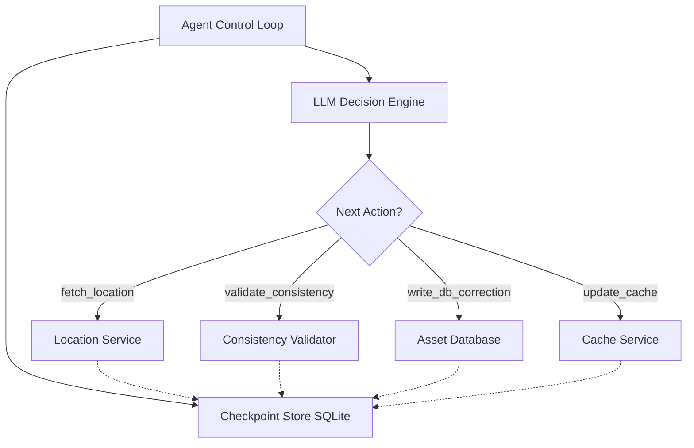

# Resilient Asset Agent

A fault-tolerant AI agent that synchronizes asset state across distributed services with intelligent failure recovery.

## Overview

This project implements a **LLM-driven workflow orchestrator** that:
- Executes multi-step asset synchronization workflows
- Detects and recovers from partial failures without re-doing completed work
- Maintains persistent checkpoint state for crash recovery
- Uses local LLM (Qwen 35B) for dynamic decision-making

## Architecture



## Components

### `stubs/services.py` - Mock Distributed Services
- **LocationService**: Returns asset coordinates (supports stale data injection)
- **AssetDatabase**: Handles persistent writes (supports partial write simulation)
- **CacheService**: Fast cache layer (most failure-prone - can timeout independently)

### `agent/checkpointer.py` - State Persistence
- SQLite-based checkpoint store
- Idempotency guarantees (never re-executes completed steps)
- Sub-task tracking with `SUCCESS` / `FAILED` / `UNKNOWN` status
- Append-only event log (audit trail / mission log)
- Full execution trace for audit/debugging

### `agent/tools.py` - Idempotent Tool Wrappers
- Each tool checks checkpoint before execution
- Returns cached results if step already completed
- Generates idempotency keys for every mutation
- Tracks sub-task status and emits audit-trail events
- Distinguishes `UNKNOWN` (timeout) from `FAILED` (hard error)

### `agent/runner.py` - Agent Control Loop
- LLM-driven dynamic workflow (not fixed sequence)
- Evaluates current state to decide next action
- Handles max iterations and recovery logic

## How to Run It

### Prerequisites
- Python 3.10+
- Local LLM server running on `localhost:8000` (e.g., `llama-server.exe`, LM Studio, vLLM) with model `qwen3.8-27b`

### Installation

```bash
# Create virtual environment
python -m venv venv
.\venv\Scripts\activate  # Windows
source venv/bin/activate  # macOS/Linux

# Install dependencies
pip install -r requirements.txt
```

### Running the Agent

**Normal execution (no failures):**
```bash
python main.py --run-id video-demo
```

**Simulate cache timeout (demonstrates intelligent failure recovery):**
```bash
python main.py --run-id video-demo --fail-at cache_update
```

**Combine multiple failure injections:**
```bash
python main.py --run-id complex-scenario --fail-at cache_update --partial-write
```

### Debug Visualizer

Monitor agent execution in real-time via web dashboard:

```bash
cd debug_visualizer
.\run.bat  # or python server.py
```

Open `http://localhost:5000` in your browser. Use the mode toggle to switch between [LATEST] Follow Latest (auto-refreshes newest run) and [MONITOR] Monitor Run (stays on selected run).

## Failure Recovery Demo

### Scenario: Cache Timeout After DB Write

1. **First Run**: Agent executes fetch → validate → write_db (success) → update_cache (FAILS with timeout)
2. **Second Run**: Agent reads checkpoint, sees DB write completed, skips it, retries only the failed cache step

This demonstrates the core assessment requirement: **intelligent recovery without duplicating work**.

## Distributed Systems Upgrades

Beyond basic checkpointing, the agent implements three patterns drawn from real distributed-systems orchestration (event-sourced state machines, idempotent mutations, and indeterminate-outcome handling).

### 1. Sub-Task Granularity & the UNKNOWN State

A network timeout is **not** a hard failure — the write may have committed server-side but the response was lost. The agent models this with per-sub-task status and a distinct `UNKNOWN` state, rather than collapsing everything into `FAILED`.

Each mutating step tracks its sub-tasks independently. A cache timeout after a successful DB write produces:

```json
{
  "step_name": "update_cache",
  "status": "PARTIAL_FAILURE",
  "sub_tasks": {
    "cache_invalidation": "UNKNOWN"
  },
  "error": "TimeoutError: Cache update timed out after 3s"
}
```

The terminal surfaces this explicitly:

```
[UNKNOWN] update_cache: Cache update timed out after 3s (cache update may have succeeded)
[SUBTASKS] update_cache:
  - cache_invalidation: [UNKNOWN]
```

Because the outcome is indeterminate, the agent does **not** blindly retry (which risks a duplicate write) — it runs a health check and halts if the service is down, leaving the sub-task in `UNKNOWN` for reconciliation.

### 2. Append-Only Event Log (Audit Trail)

Every meaningful transition is appended to an immutable event stream (the `events` table), mirroring the mission-log pattern used by distributed orchestrators. The full log is printed at the end of each run:

```json
{"timestamp": "2026-08-14T18:28:02Z", "run_id": "test-final-001", "event": "RUN_STARTED", "max_iterations": 15}
{"timestamp": "2026-08-14T18:28:02Z", "run_id": "test-final-001", "event": "STEP_STARTED", "subtask": "database_write", "idempotency_key": "test-final-001:write_db_correction:database_write"}
{"timestamp": "2026-08-14T18:28:02Z", "run_id": "test-final-001", "event": "SUBTASK_COMMITTED", "subtask": "database_write", "tx_id": "tx_1786728479", "status": "completed"}
{"timestamp": "2026-08-14T18:28:05Z", "run_id": "test-final-001", "event": "NETWORK_TIMEOUT", "subtask": "cache_invalidation", "error": "Cache update timed out after 3s"}
{"timestamp": "2026-08-14T18:28:05Z", "run_id": "test-final-001", "event": "RECONCILIATION_STARTED", "subtask": "update_cache", "trigger": "step_failure", "action": "check_system_health"}
{"timestamp": "2026-08-14T18:28:05Z", "run_id": "test-final-001", "event": "WORKFLOW_HALTED", "down_services": ["cache"], "reason": "service_unavailable"}
```

The debug visualizer renders this as a color-coded **Audit Trail** panel.

### 3. Idempotency Keys on Mutations

Every mutating call (DB write, cache update) carries an explicit **idempotency key** composed of `f"{run_id}:{step_name}:{sub_task}"`. The mock services maintain an idempotency registry: if a mutation is retried with a key they've already processed, they **replay the original result** instead of re-executing — exactly how real idempotency keys prevent duplicate side-effects on retry.

```
idempotency_key = "test-final-001:update_cache:cache_invalidation"
```

This is visible in the event log, the sub-task records, and the step output.

## What I Would Do With More Time

1. **Distributed Locking (Redis/mutex)**: Prevent race conditions during concurrent agent executions by implementing a distributed lock manager that ensures only one agent can modify the same asset at a time.

2. **Saga Compensating Transactions**: If cache recovery permanently fails, roll back the DB write with a compensating transaction to maintain data consistency across services — ensuring atomicity even when partial failures occur.

3. **Streaming LLM Reasoning to CLI/UI**: Stream LLM reasoning tokens directly to the terminal and debug visualizer for lower-latency feedback, so users can see the agent "thinking" in real-time rather than waiting for full responses.

4. **Adaptive Retry with Exponential Backoff**: Replace fixed retry limits with intelligent backoff strategies that increase wait times between retries based on service health trends and historical recovery patterns.

## Project Structure

```
resilient-asset-agent/
├── stubs/
│   ├── __init__.py
│   └── services.py        # Mock Location, DB & Cache APIs + failure knobs
├── agent/
│   ├── __init__.py
│   ├── checkpointer.py    # SQLite / JSON state persistence
│   ├── tools.py           # Idempotent tool wrappers around stubs
│   └── runner.py          # Ollama LLM prompt loop & dynamic decision maker
├── .gitignore
├── requirements.txt
├── main.py                # Main CLI runner (with failure injection flags)
└── README.md              # This file
```

## License

MIT

---

## Development History

### Bugs Encountered & Fixed

| Bug | Root Cause | Solution |
|-----|-----------|----------|
| JSON Parse Errors | Markdown code blocks in LLM response (` ```json `) | Strip delimiters, skip language identifiers, add fallback action |
| Empty LLM Responses | Extended thinking mode returning nothing | Simplified prompt, max_tokens=200, timeout=10s, force-progress after 2 empty responses |
| Windows Encoding | Emoji characters (❌✅⏭️) not supported in PowerShell | Replaced with text markers: `[FAIL]`, `[OK]`, `[SKIP]` |
| Duplicate Execution | No idempotency check before tool calls | Pre-execution checkpoint guard in all tool wrappers |
| Connection Hangs | No timeout on LLM API calls | Added `timeout=10` and MAX_ITERATIONS limit (10) |

See [BUGS_AND_FIXES.md](BUGS_AND_FIXES.md) for detailed analysis of each fix.

### Implementation Phases

- **Phase 1**: Foundation — services, checkpointer, tools, runner, CLI entry point
- **Phase 2**: Basic Testing — LLM connection, mock services, checkpoint persistence
- **Phase 3**: Debug & Refinement — 6 bugs fixed (see above)
- **Phase 4**: Testing & Validation — normal workflow, failure recovery, idempotency verified
- **Phase 5**: Documentation & Visualizer — README, debug dashboard

### Lessons Learned

1. **LLM Response Robustness**: Always handle markdown code blocks and provide fallback parsing
2. **Timeout Everything**: External service calls must have timeouts to prevent indefinite hangs
3. **Idempotency First**: Check state before executing; persist atomically after execution
4. **Clear Logging**: Text-based status markers (`[SKIP]`, `[EXECUTE]`, `[OK]`, `[FAIL]`) aid debugging and demos
5. **Platform Compatibility**: Avoid emoji/special characters for cross-terminal compatibility
