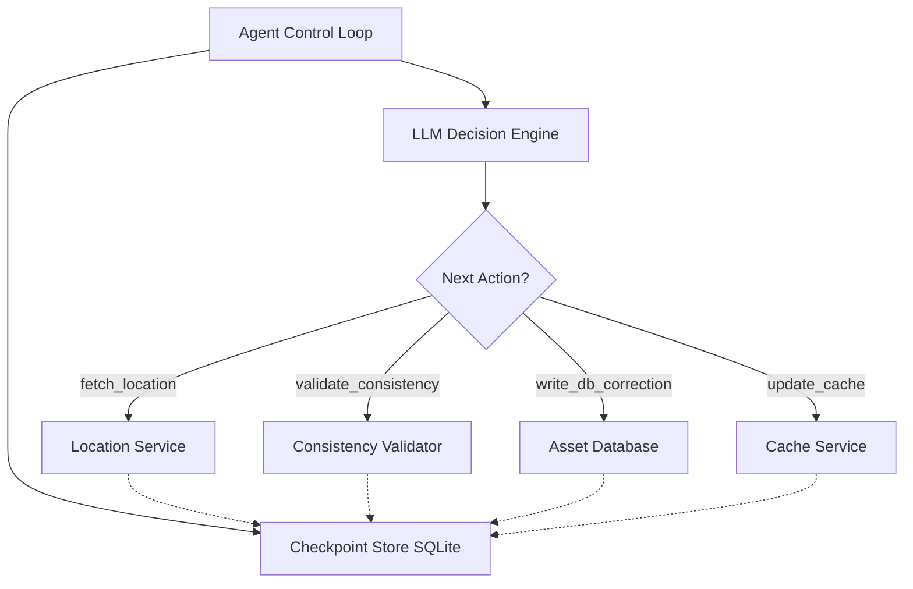

# Resilient Asset Agent

A fault-tolerant AI agent that synchronizes asset state across distributed services with intelligent failure recovery.

## Overview

This project implements a **LLM-driven workflow orchestrator** that:
- Executes multi-step asset synchronization workflows
- Detects and recovers from partial failures without re-doing completed work
- Maintains persistent checkpoint state for crash recovery
- Uses local LLM (Qwen 35B) for dynamic decision-making

## Architecture



## Components

### `stubs/services.py` - Mock Distributed Services
- **LocationService**: Returns asset coordinates (supports stale data injection)
- **AssetDatabase**: Handles persistent writes (supports partial write simulation)
- **CacheService**: Fast cache layer (most failure-prone - can timeout independently)

### `agent/checkpointer.py` - State Persistence
- SQLite-based checkpoint store
- Idempotency guarantees (never re-executes completed steps)
- Full execution trace for audit/debugging

### `agent/tools.py` - Idempotent Tool Wrappers
- Each tool checks checkpoint before execution
- Returns cached results if step already completed
- Logs failures with error details

### `agent/runner.py` - Agent Control Loop
- LLM-driven dynamic workflow (not fixed sequence)
- Evaluates current state to decide next action
- Handles max iterations and recovery logic

## How to Run It

### Prerequisites
- Python 3.10+
- Local LLM server running on `localhost:8000` (e.g., `llama-server.exe`, LM Studio, vLLM) with model `qwen3.6-35b`

### Installation

```bash
# Create virtual environment
python -m venv venv
.\venv\Scripts\activate  # Windows
source venv/bin/activate  # macOS/Linux

# Install dependencies
pip install -r requirements.txt
```

### Running the Agent

**Normal execution (no failures):**
```bash
python main.py --run-id video-demo
```

**Simulate cache timeout (demonstrates intelligent failure recovery):**
```bash
python main.py --run-id video-demo --fail-at cache_update
```

**Combine multiple failure injections:**
```bash
python main.py --run-id complex-scenario --fail-at cache_update --partial-write
```

### Debug Visualizer

Monitor agent execution in real-time via web dashboard:

```bash
cd debug_visualizer
.\run.bat  # or python server.py
```

Open `http://localhost:5000` in your browser. Use the mode toggle to switch between [LATEST] Follow Latest (auto-refreshes newest run) and [MONITOR] Monitor Run (stays on selected run).

## Failure Recovery Demo

### Scenario: Cache Timeout After DB Write

1. **First Run**: Agent executes fetch → validate → write_db (success) → update_cache (FAILS with timeout)
2. **Second Run**: Agent reads checkpoint, sees DB write completed, skips it, retries only the failed cache step

This demonstrates the core assessment requirement: **intelligent recovery without duplicating work**.

## What I Would Do With More Time

1. **Distributed Locking (Redis/mutex)**: Prevent race conditions during concurrent agent executions by implementing a distributed lock manager that ensures only one agent can modify the same asset at a time.

2. **Saga Compensating Transactions**: If cache recovery permanently fails, roll back the DB write with a compensating transaction to maintain data consistency across services — ensuring atomicity even when partial failures occur.

3. **Streaming LLM Reasoning to CLI/UI**: Stream LLM reasoning tokens directly to the terminal and debug visualizer for lower-latency feedback, so users can see the agent "thinking" in real-time rather than waiting for full responses.

4. **Adaptive Retry with Exponential Backoff**: Replace fixed retry limits with intelligent backoff strategies that increase wait times between retries based on service health trends and historical recovery patterns.

## Project Structure

```
resilient-asset-agent/
├── stubs/
│   ├── __init__.py
│   └── services.py        # Mock Location, DB & Cache APIs + failure knobs
├── agent/
│   ├── __init__.py
│   ├── checkpointer.py    # SQLite / JSON state persistence
│   ├── tools.py           # Idempotent tool wrappers around stubs
│   └── runner.py          # Ollama LLM prompt loop & dynamic decision maker
├── .gitignore
├── requirements.txt
├── main.py                # Main CLI runner (with failure injection flags)
└── README.md              # This file
```

## License

MIT
